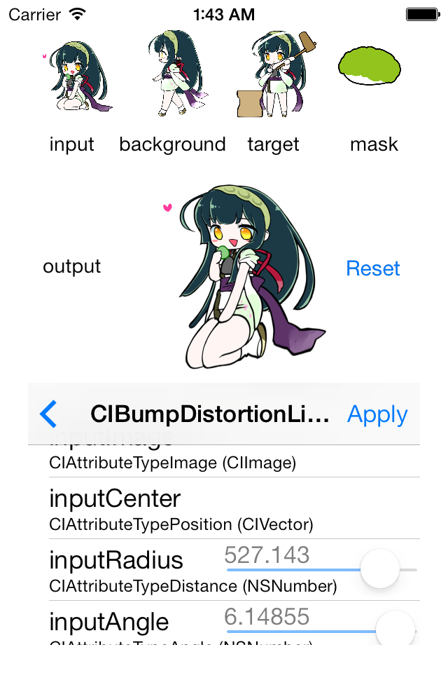

CIFilters
============
Core Image Filter の学習用サンプルです。
とりあえず inputImage, backgroudImage, targetImage, maskImage と、NSNumber クラスの入力値を取り扱うようにしました。
他の入力値(CIVector等)は追って作ります。

画像データは「東北ずん子」サイト様 (http://zunko.jp/) のものを利用させて頂いています。この場を借りて御礼申し上げます。
